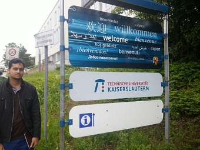
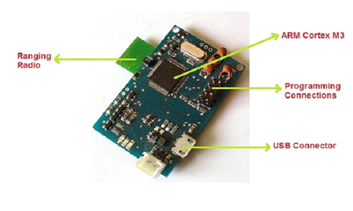
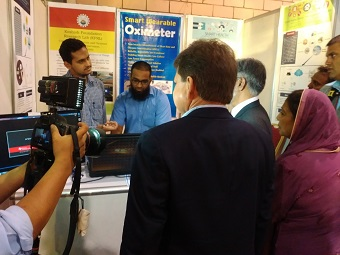

I am Faizan Darwesh, I did my Bachelors in Computer Science from Karachi University , Department of Computer Science UBIT, Pakistan.

## Chief Interests

My chief interest is in developing applications that are capable of solving and providing easy ways to perform regular tasks.
I'm interested in working on technologies like Android / NodeJs, Angular and have also completed several online courses related to Android , Angular and NodeJs.
<!--  ----------------|-----------------------------
Research Areas  | <button class="skill-badge-green">Computer Vision</button> <button class="skill-badge-green">Artificial Intelligence</button> <button class="skill-badge-green">Machine Learning</button> <button class="skill-badge-green">Deep Learning</button>
-->
#### Skills Summary

----------------|-----------------------------
Programming     | <button class="skill-badge-blue">C/C++</button> <button class="skill-badge-blue">Java</button> <button class="skill-badge-blue">C#</button> <button class="skill-badge-blue">PHP</button> <button class="skill-badge-blue">VCS (Git)</button>
 Databases       | <button class="skill-badge-blue">MySQL</button> <button class="skill-badge-blue">Firebase</button> <button class="skill-badge-blue">MongoDB</button> <button class="skill-badge-blue">Sqlite</button>
Technologies        | <button class="skill-badge-green">Android</button> <button class="skill-badge-gree">NodeJs</button>
<!--<button class="skill-badge-blue">Apache Flume</button> <button class="skill-badge-blue">Apache Hive</button>
-->
## Projects
<!--### TU Kaiserslautern / German Research Center for AI, Kaiserslautern, Germany

Research Intern (June 2016 - August 2016)

---
In German, Deutsches Forschungszentrum für Künstliche Intelligenz

Internship supervisors:
- Dr. Prof. h.c. Andreas Dengel ([TU KL](http://agd.informatik.uni-kl.de/team/lehre/prof-dr-prof-hc-andreas-dengel/) / [DFKI](https://www.dfki.de/web/kontakt/mitarbeiter?uid=ande00) / [Google Scholar](https://scholar.google.com/citations?user=p3YP0DMAAAAJ&hl=en))
- Dr-Ing. Syed Saqib Bukhari ([TU KL](http://agd.informatik.uni-kl.de/team/lehre/dr-saquib-bukhari/) / [DFKI](http://dfki.de/~bukhari/) / [Google Scholar](https://scholar.google.com/citations?user=q3ecbfMAAAAJ&hl=en))

This internship was part of Smart Agriculture project collaboration between NED University (Pakistan) and DFKI (Germany). During this internship I learned how AI and ML is being used at DFKI to solve many different problems in fields like agriculture, farming, smart books/learning, document understanding and segmentation.

As part of my project study, I gave following 2 presentations:

[Commercial and Research Landscape for Smart Irrigation Systems](https://www.slideshare.net/MuhammadYaseenAftab1/commercial-research-landscape-for-smart-irrigation-systems) - Presented as part of an initial project study at DFKI.

[Smart Irrigation Systems - Hardware Architecture](https://www.slideshare.net/MuhammadYaseenAftab1/smart-irrigation-system-hardware-architecture-for-warm-project) - A presentation I gave at 10th Workshop on Field and Assistive Robotics [(WFAR 10)](https://agrosy.informatik.uni-kl.de/en/conferences/wfar/wfar10/) at Schloss Dagstuhl in Wadern, Germany.

### Research Center for AI, NED University

Research Student (June 2015 - December 2016)

---

Supervisor: Dr. Muhammad Khurram ([NED UET](http://www.neduet.edu.pk/cise/mkhurram.html) / [RCAI](http://rcai.pk/ResearchCenterAI/ourteam/director.html))

I was among the first members of newly formed RCAI established at NED University. At RCAI I worked mainly on projects leveraging the Internet of Things (IoT) technology.
-->
* **Route Drawing Android App** [(Project Link)](https://github.com/faizandarwesh/CG-Project): In this application we provide a way for our user to find the route from location A to location B using Google Map API. Inorder to find the route user have to set pointer on his current location and then drag the pointer to drop off location so that app guided the track using Google Map Api.
* **Angular & NodeJs Shopping List App** [(Project Link)](https://github.com/faizandarwesh/NodeJs-Shopping-List-App): In this particular web-based application user can maintain a Shopping List and can add, edit and delete items from that list as per need. Behind the scenes it performs basic CRUD operations using MongoDB.

<!--

[Blog Post](https://yaseenx.wordpress.com/2016/06/11/presenting-my-paper-at-1st-ieec-conference/) about project

Project presentation: [A Smart Safety Gadget for Avoiding Accidents in Warehouse Environment](https://www.slideshare.net/MuhammadYaseenAftab1/a-smart-safety-gadget-for-avoiding-accidents-in-warehouse-environment)
-->

* **To-do-List App using NodeJs** [(Project Link)](https://github.com/faizandarwesh/To-do-List-App-using-Node-js): In this project I worked on basic CRUD operations using MongoDB to create a simple to-do-list app that holds the task that user want to do in future and keep track of them.

* **Vending Machine Project** [(Project Link)](https://github.com/faizandarwesh/To-do-List-App-using-Node-js): This is a C# form based application that is useful for purchasing items like chips, drinks and some other items.

* **Food Ordering Android App** [(Project Link)](https://github.com/faizandarwesh/To-do-List-App-using-Node-js): This application is based on Ordering food items from selected categories and add all the order to the ordered list and send all the order details to the user via email.

* **Friendly Chat Android App** [(Project Link)](https://github.com/faizandarwesh/To-do-List-App-using-Node-js): This project is based on the implementation of a group chat application using Firebase Database. By using this app user can create an account and then able to change and exchange media files with group members.

* **Pizza Zone App** [(Project Link)](https://github.com/faizandarwesh/Pizza-Project): This is a C# form based application that is used for the purposes of ordering pizza. It includes some other items like drinks and salads and also maintain billing information of the order.  

<!---->

<!-- ## Work Experience

### PureVPN (via Disrupt Ventures)

Machine Learning Engineer (December 2016 - Present)

---
Achievements:

* Deployment of company's first Apache Spark cluster
* Deployment of company's first Apache Hadoop cluster
* Architecting company's first Machine Learning pipeline

Problems I have worked with:

* Customer churn
Identifying the reasons of churn
Support marketing teams in designing targeted campaigns based on data driven insights
Predict customers that are more likely to churn
A consistent and company-wide accepted measure of churn.

* Infrastructure health, and capacity planning
In this project I worked on development and deployment of data ingestion and storage pipeline. Collection and robust, scalable storage of machine generated metrics of a global network. The data was then used for monitoring the health of global IT infrastructure. Aid in scheduled load and capacity planning. This also reduced the manual effort of gathering data and compiling hefty reports, and increased accuracy and visibility.

<!-- ### Electronics Design Center, NED University

Research Student (January 2015 - April 2015)

---

Smart Doorbell

In Electronics Design Center I was responsible for:  

* Hardware-Software interfacing, testing, and debugging.
* Software development for Embedded Systems  
-->
<!-- ### Hyphen Consultancy

Freelance Remote Web Developer (August 2012 - October 2014)

---

As a freelancer with Hyphen Consultancy I worked on:  
Database driven Web Applications (Primarily PHP and MySQL, occasionally ASP.Net and MS SQL Server)
Rich Internet Applications using Google Web Toolkit (Java)
-->
## Online Courses and Certifications

I did following online courses to enhance my knowledge of Web and Mobile App Development

|-------------------
|Become a MEAN Stack Developer 
|Android Basics : User Input 
|PHP with MySQL Essential Training 
|Version Control with Git 
|Android Basics : Multiscreen Apps 
|Android Basics : Networking 
|Firebase in a Weekend (Android) 

## Events and Seminars

|-------------------------------------------------------
| Runners Up in RoboWars Competition at IBA ProBattle 2017
| Participated in Speed Programming Competition held at NED in SPEC16.
| Participated in IQUEST Competition in PROQUEST16 at Karachi University Computer Science Department (UBIT).
| Introduction to HTML, CSS and JavaScript organised by ACM-KU
| Android Development Workshop at DCS organised by IEEE.

## I have programming experience in:

* Java, C, C#
* PHP, HTML, CSS, NodeJs , Angular
* Version Control Systems e.g. Git
* Android programming

## Databases I have worked with

* MySQL, Firebase, Sqlite, MongoDB

<!-- ## Other Interests

* History (Contemporary, Medieval, Antiquity)
* Philosophy
* Amateur Astronomy, [Astronomy Society](https://www.facebook.com/KarachiAstronomy/)
* Literature, Reading ([2016](https://yaseenx.wordpress.com/2017/01/21/what-i-read-in-2016/), [2017](https://yaseenx.wordpress.com/2018/02/11/what-i-read-in-2017/)), Writing ([Blog](http://yaseenx.wordpress.com))
-->
<a name="contact" />
## Contact

* faizandarwesh@outlook.com
<!--* [@nisaydhm](twitter.com/nisaydhm)
-->
